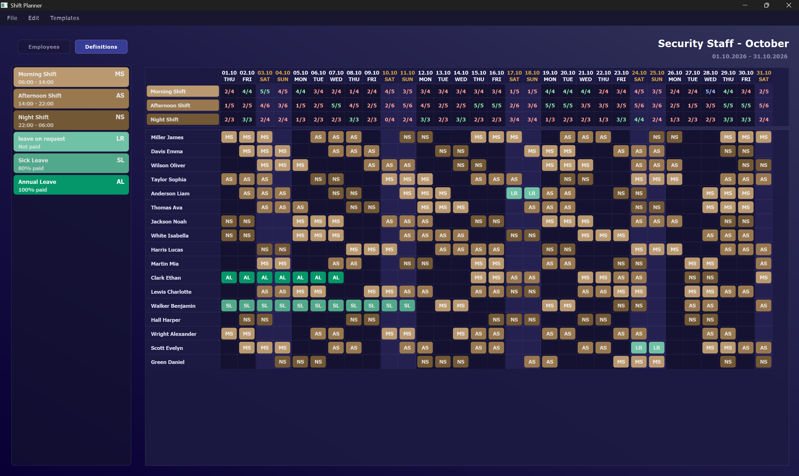
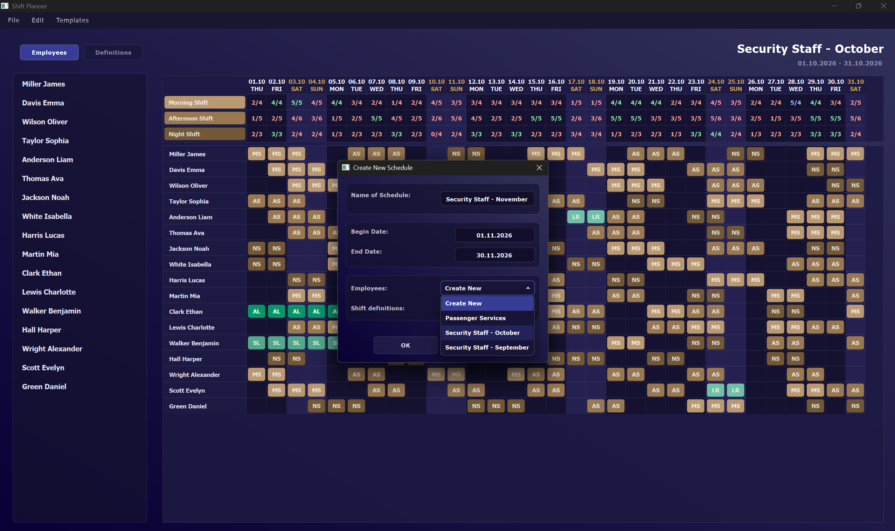

# ShiftPlanner

A desktop shift scheduling application built with **CMake**, **C++23**, and **Qt6**. Designed to streamline the planning and validation of monthly work schedules, with demand tracking and reusable staff/shift templates to accelerate schedule generation.

The project is structured according to **Screaming Architecture**, organizing the codebase around business domains (`employee`, `schedules_entry`, `schedule_demands`, `schedule_assignments`) with a strict separation between domain logic (`core`) and presentation (`ui`). State persistence is currently handled via direct JSON serialization and deserialization. This tight coupling to the JSON format is a known limitation that is slated for refactoring behind proper repository abstractions.

The UI is built with **Qt Widgets** using the **Model/View/Delegate** pattern. Dialog and UI flows are abstracted behind **service interfaces** to follow the Dependency Inversion Principle, decoupling presentation from domain logic and simplifying unit testing and mocking (unit tests are not yet implemented).

---

## Key Features

* **Reusable Employee & Schedule Entry Templates:**
  * Save employee lists and shift definitions (further called *schedule entries*, including off-time) as standalone templates.
  * Fork existing templates for new schedules (e.g., branching `Staff October` into `Staff November` with newly added staff).
  * Load, update, or remove templates independently across schedules.

* **Interactive Entity Management (CRUD & Reordering):**
  * Full CRUD for employees and schedule entries via the toolbar or context menus (and double click to edit).
  * Schedule entry configuration with visual customization, including custom working hours (currently unutilized) and color-tagging from a fixed palette.
  * Drag-and-drop support for manual reordering of employees and schedule entries.

* **Demand tracking and validation:**
  * Granular demand configuration per specific day and shift type, alongside recurring weekly presets (e.g., configuring every Monday with 5 day shifts and 3 night shifts).
  * Header-level shift counters displaying current coverage against configured requirements.
  * Instant visual feedback via color indicators: red (understaffed), green (target reached), and blue (overstaffed).

* **Reactive Schedule State:**
  * Synchronization across views: modifying a schedule entry (such as updating its display color) immediately updates all grid occurrences.
  * Cascading updates: removing an employee automatically purges their associated assignments from the active schedule.

---

## Screenshot

  

  

  

