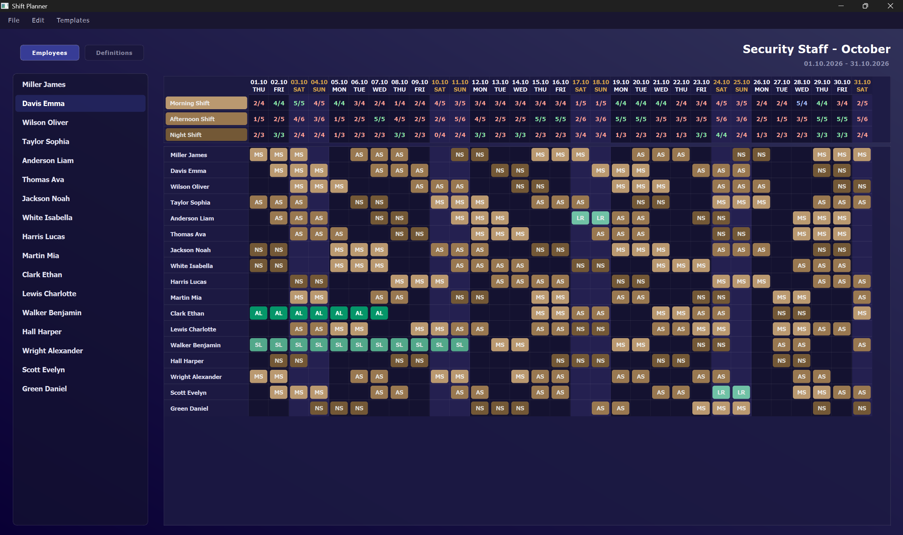

# ShiftPlanner

A desktop shift scheduling application built with **CMake**, **C++23** and **Qt6**. It enables managing reusable employee and shift templates to quickly generate and organize schedules.

---

## Screenshot

  

